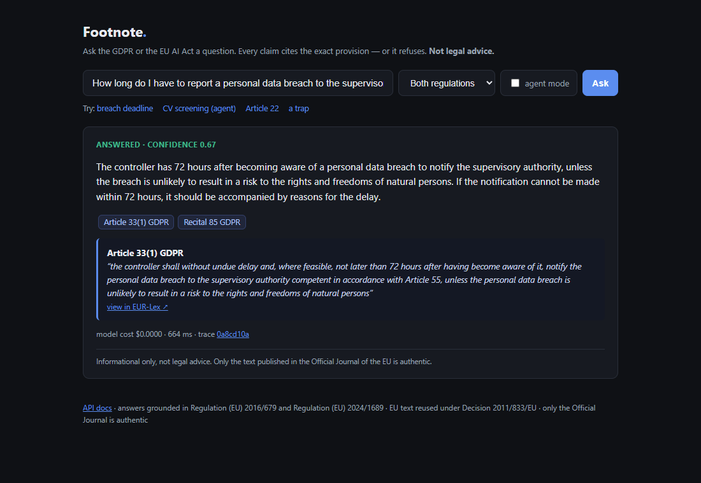
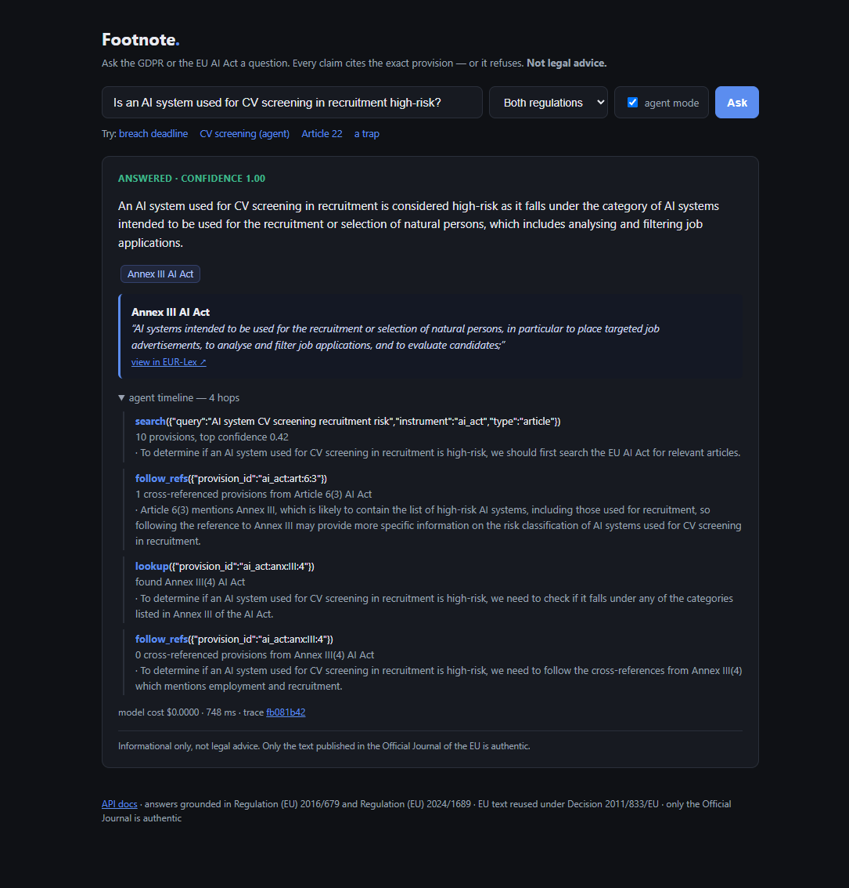
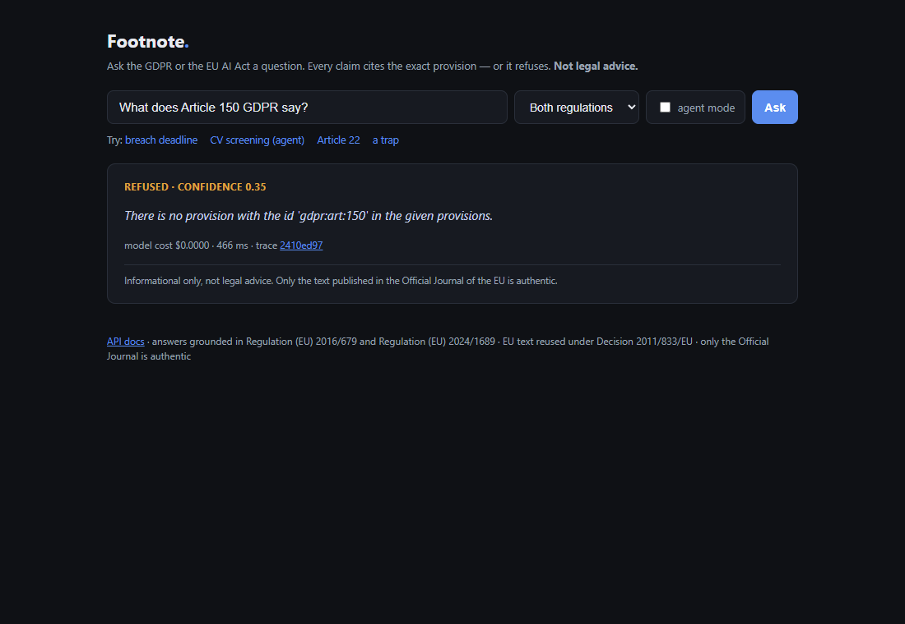

# Footnote

*Ask the GDPR or the EU AI Act a question. Get the exact article quoted — or an honest refusal.*

Grounded question-answering over EU regulations. Every claim cites the provision it came
from, quotes it **verbatim** (verified in code, not trusted from the model), and links to
EUR-Lex. When the regulations don't answer the question, it says so instead of guessing.

**Not legal advice.** Only the text published in the Official Journal of the EU is authentic.

**[▶ Try it live](https://footnote-6u6u.onrender.com)** — free-tier hosting: if it's been
idle, the first load takes about a minute while the instance wakes.

---



*A grounded answer: the claim, the citation chip, the verbatim quote from Article 33(1)
GDPR, the EUR-Lex link, and the cost/latency/trace line.*



*Agent mode on a cross-referencing question: search → follow Article 6(3)'s reference →
Annex III(4) (employment) → answer, with per-hop reasoning.*



*A trap: Article 150 GDPR does not exist (there are 99). It refuses instead of inventing one.*

---

## The numbers

Measured on a committed golden set, reproducible with one command. Full result files with
per-question records live in [`results/`](results/).

**Refusal behaviour** — 22 questions that must NOT be answered:

| Class | n | Correct refusal | False-answer rate |
|---|---|---|---|
| Out-of-scope ("what's the weather") | 8 | 100% | **0.0** |
| In-domain but unanswerable (Georgian law, CCPA, ePrivacy) | 8 | 100% | **0.0** |
| Trap provisions ("What does Article 150 GDPR say?" — there are 99) | 6 | 100% | **0.0** |
| **Fabricated provisions cited** | | | **0.0** |

**Answer quality** — 30 realistic questions with gold provisions:

| Metric | Value |
|---|---|
| Answered (vs over-refused) | 96.7% |
| Answers citing a gold provision | 93.1% |
| Citation precision vs narrow gold set | 65.1% † |
| Verbatim quote integrity | 100% (enforced in code) |

† The model often cites *additional* relevant provisions (explanatory recitals, adjacent
articles) beyond the 1–3 gold ones — counted against precision here. See honest notes below.

**Retrieval** — hybrid dense + BM25 + rerank, 53 queries:

| Subset | Recall@10 | MRR | Gold in top-5 |
|---|---|---|---|
| Realistic questions (30) | 0.967 | 0.837 | 0.967 |
| Recital-paraphrase queries (23, hard) | 0.174 | 0.053 | 0.087 |

The recital subset uses long explanatory text as queries — deliberately hard, kept because
reporting only the easy subset would be lying with statistics.

**Agent vs single-shot** — 10 cross-reference questions (article defers to an annex):

| Mode | Mean gold coverage | Answered | Mean wall time |
|---|---|---|---|
| Single-shot | 0.417 | 90% | 32s |
| Agent, ≤4 hops | 0.417 | 90% | 108s |

**A measured negative result**: on these template multi-hop questions the agent ties
single-shot at 3.4× the latency — hybrid retrieval usually surfaces the article *and* its
annex in one pass. The agent rescued one total retrieval miss (Article 23: 0.0 → 0.5) and
regressed one (Article 25). Where it earns its keep is qualitative: on *"is CV screening
high-risk?"* it visibly walks Article 6(2) → Annex III → item 4 and cites the exact
employment item, with per-hop reasoning in the trace. The loop is a tool for the cases
retrieval misses, not a default — which is why `agent` is opt-in, not the default path.

**Model bake-off** — free-tier models measured before pinning (8 fixed questions):

| Model | Valid JSON | Grounded | Refusals | Median latency |
|---|---|---|---|---|
| groq::llama-3.3-70b-versatile ← pinned | 8/8 | 5/6 | 2/2 | **1.5s** |
| gemini::flash-lite ← fallback | 8/8 | 6/6 | 2/2 | 4.9s |
| openrouter gpt-oss-20b | 7/8 | 4/6 | 2/2 | 42s |
| openrouter nemotron-ultra-550b | 5/8 | 4/6 | 2/2 | 30s |

## How it works

```
question ──► scope gate ──► hybrid retrieval ──► confidence gate ──► generation ──► citation
             (off-topic?)    dense (Qdrant)       (too weak? refuse)  (pinned LLM)   verification
                             + BM25, RRF fusion                                      (verbatim or reject)
                             + rerank (Jina)
```

- **Corpus**: GDPR (Reg. 2016/679) + EU AI Act (Reg. 2024/1689), fetched from the official
  Publications Office API and parsed **structure-aware**: 2,411 provisions addressable down
  to point level (`gdpr:art:6:1:f` = Article 6(1)(f) GDPR), with cross-references resolved.
- **Citations are legal citations** — "Article 6(1)(f) GDPR", "Annex III(4) AI Act" — copied
  from the parsed record, never generated by the model. Quotes must appear verbatim in the
  cited provision or the citation is rejected and the answer degrades to a refusal.
- **Agent mode** walks the cross-reference graph: *"Is CV screening high-risk?"* →
  Article 6(2) → follows the reference → Annex III → item 4 (employment) → answer. Bounded
  by max-hops, a cost ceiling, no-progress detection, and a cycle guard — every hop traced
  with its reasoning.
- **Every query traced**: retrieved provisions, scores, model, tokens, cost, latency,
  which gate fired. SQLite, one row per question, same schema for CLI / REST / MCP / agent.

## Use it

**CLI**
```bash
pip install -e .
footnote ask "How long do I have to report a data breach?"
footnote ask "Is CV screening high-risk under the AI Act?" --agent
footnote search "legitimate interest" --instrument gdpr --type article
```

**REST API** — `uvicorn app.main:app` → interactive docs at `/docs`, single-page UI at `/`.
A refusal is a `200` with `verdict: "refused"` — never an error.

**MCP server** — give any agent grounded EU-regulation tools:
```json
{ "mcpServers": { "footnote": { "command": "footnote-mcp", "cwd": "/path/to/Footnote" } } }
```
Tools: `search`, `lookup` (by id or citation), `answer` (with `agent: true` for multi-hop),
`list_instruments`. Refusals return as results, the disclaimer travels in every payload,
and cost/latency come back so a calling agent can budget.

**Reproduce the evals**
```bash
footnote eval --out results/retrieval.json          # retrieval suite (no LLM)
python scripts/run_answer_eval.py                    # answer + refusal suites
python scripts/run_agent_compare.py                  # agent vs single-shot
```

## Honest engineering notes

- **Citation precision (0.65) is measured against a deliberately narrow gold set.** When the
  model answers a breach-notification question citing Article 33 *and* Recital 85, the recital
  counts as a miss. I kept the strict metric rather than widening the gold set post hoc.
- **The recital-paraphrase retrieval subset scores badly (0.17 recall).** Long discursive text
  as a query is a known hard case for both dense and sparse retrieval. It stays in the suite.
- **The golden set is author-assembled**, derived mechanically where possible (recital→article
  mentions, cross-reference chains) and hand-written elsewhere. It is not lawyer-verified.
- **Free tiers shape the architecture.** OpenRouter's 50-requests/day cap forced a fallback
  chain across *providers*, not just models. Embeddings and reranks are disk-cached so eval
  reruns cost zero quota. Cost-per-query is recorded at list price ($0 on free tiers) with
  actual tokens alongside.
- **Zero fabrication is enforced, not emergent**: quotes are substring-verified against the
  cited provision; citation labels come from the parser, not the model. A model that invents
  Article 150 gets caught by the verifier even if the retrieval let it through.
- **OJ versions, not consolidated**: the consolidated EUR-Lex texts drop the recital and
  paragraph anchors the citation model depends on (and the AI Act has no consolidated
  edition yet). GDPR corrigenda are therefore not reflected.

## Stack

Python 3.11 · Qdrant Cloud (or embedded, zero-config) · Jina v3 embeddings + reranker ·
Groq / Gemini / OpenRouter free tiers behind a provider-swappable client · FastAPI ·
official MCP SDK · pytest (45 tests). No PyTorch — a clean clone installs in under a minute.

## License

MIT. EU legal texts are reused under Commission Decision 2011/833/EU with attribution;
the repo ships a fetcher, not the texts.
